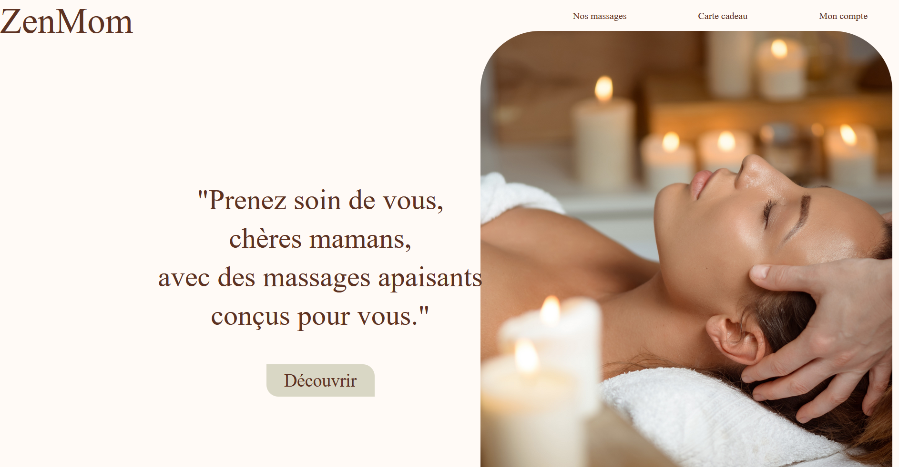
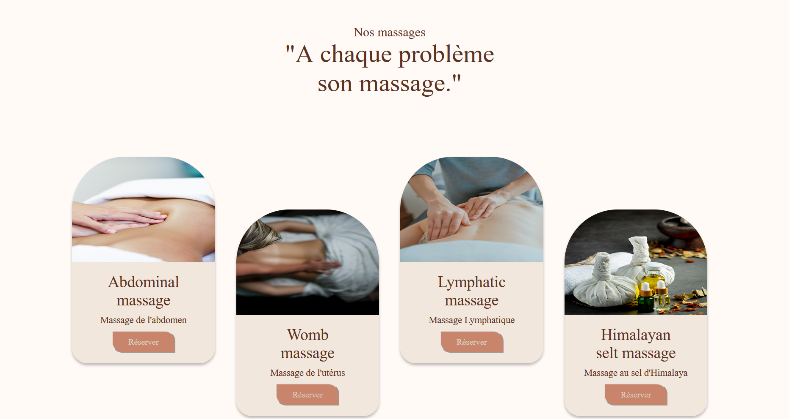
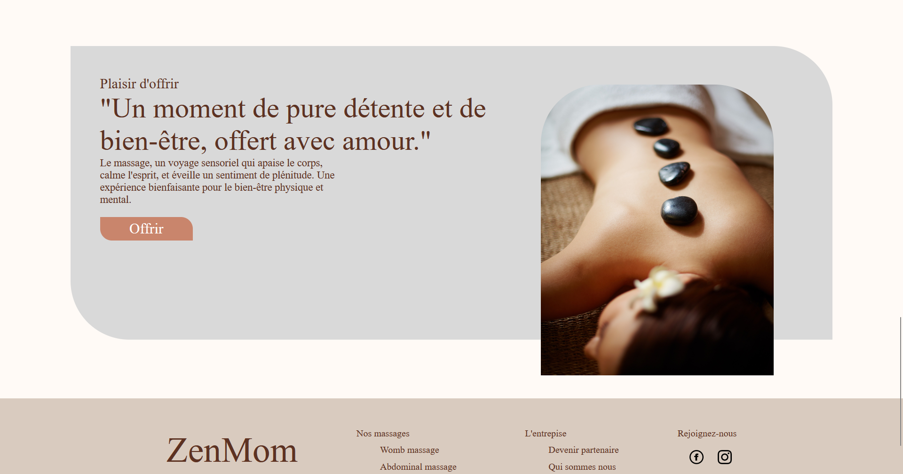

# ZENMOM - Site de Réservation de Massages pour Mamans (projet collectif de la soutenance pour le titre RNCP CDA

  Bienvenue sur ZENMOM, un site web permettant aux mamans de réserver des séances de massage avec des masseurs qualifiés. Ce README vous fournira des informations sur l'installation, l'utilisation et la contribution à ce projet.

## Table des matières
- [Introduction](#introduction)
- [Fonctionnalités](#fonctionnalités)
- [Captures d'écran](#captures-décran)
- [Utilisation](#utilisation)
- [Contribuer](#contribuer)
- [Licence](#licence)

## Introduction

ZenMom vise à faciliter la réservation de massages pour les mamans en mettant en relation des professionnels qualifiés. Aucun paiement n'est effectué sur le site lui-même, la transaction se faisant hors ligne.

## Fonctionnalités

- **Réservation de Massages :** Les mamans peuvent parcourir les profils des masseurs, choisir un type de massage, et réserver une séance.
- **Personnalisation :** Personnalisez votre séance en choisissant le type de massage, la durée et les préférences spécifiques.
- **Gestion des Disponibilités :** Les masseurs peuvent mettre à jour leurs disponibilités pour que les mamans puissent réserver en fonction de leur emploi du temps.

## Captures d'écran

*Accueil de ZenMom*

<!-- ** -->
*Interface de réservation*

## Contribuer

Si vous souhaitez contribuer à ZENMOM
Contactez-nous à l'adresse suivante : contact@zenmom.org

## Licence

MamaMassage est distribué sous la licence MIT. Consultez le fichier [LICENSE](LICENSE) pour plus d'informations.
